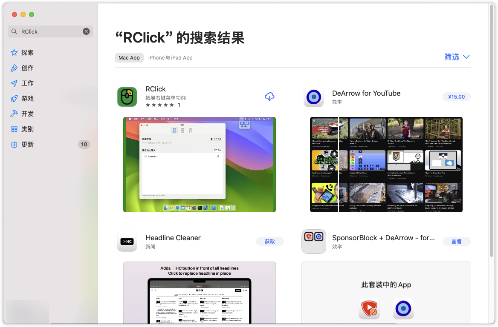

#  RClick

Config you MacOS ContextMenu items, useing Latest Swift and SwiftUI. 

## 🚀 Features

- [x] **Open with External App:**  Easily open files or directories using your preferred external application (e.g., SomeApp).
- [x] **Copy File/Folder Path:** Quickly copy the full path of the selected file or directory to the clipboard for easy sharing or referencing.
- [x] **Delete Files or Directories:**  Seamlessly delete files or directories with a single click, ensuring a smooth user experience.
- [x] **Create New Files:** Generate new files of various formats directly from the context menu, including: .txt (Plain Text).json (JSON).md (Markdown).docx (Microsoft Word).pptx (Microsoft PowerPoint).xlsx (Microsoft Excel)

## 📸 Screenshots

## 📦 Installation

The latest distribution file can be downloaded from [release page](https://github.com/wflixu/RClick/releases)

## Other similar projects:

- https://github.com/RoadToDream/SzContext
- https://github.com/Kyle-Ye/MenuHelper
- https://github.com/lexrus/SwiftyMenu 
- https://github.com/Ji4n1ng/OpenInTerminal

##  Support

If you like this project, you can support me  via  app store.

## 🤝 Report Issue

For developer and user, if you find any bug or have any suggestion, please report issue on [RClick repo](https://github.com/wflixu/RClick/issues)

## Star History

