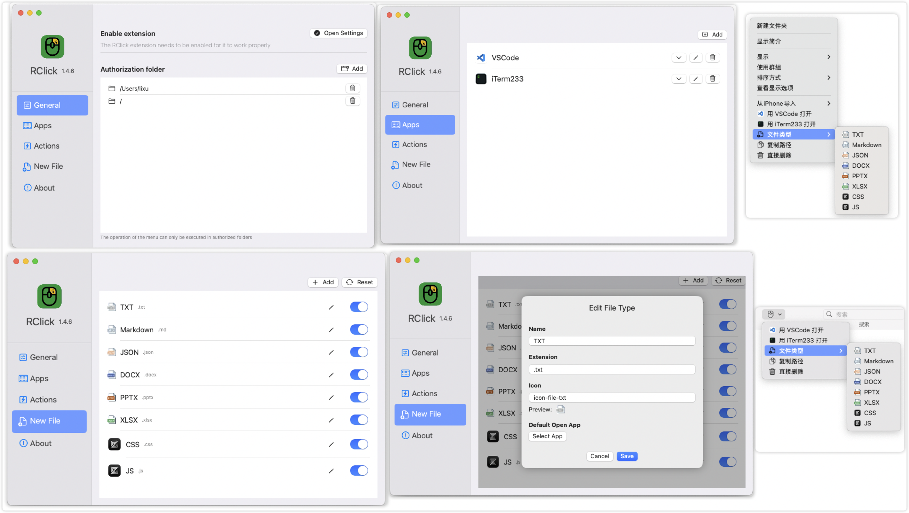

#  RClick

Config you MacOS ContextMenu items, useing Latest Swift and SwiftUI. 

## Feature

- [x] use someApp open path
- [x] copy path
- [x] delete dir or file
- [x] create file like txt json markdown docx pptx xlsx etc.

## screenshot

## Other similar projects:

- https://github.com/RoadToDream/SzContext
- https://github.com/Kyle-Ye/MenuHelper
- https://github.com/lexrus/SwiftyMenu 
- https://github.com/Ji4n1ng/OpenInTerminal

## Report Issue

For developer and user, if you find any bug or have any suggestion, please report issue on [RClick repo](https://github.com/wflixu/RClick/issues)

