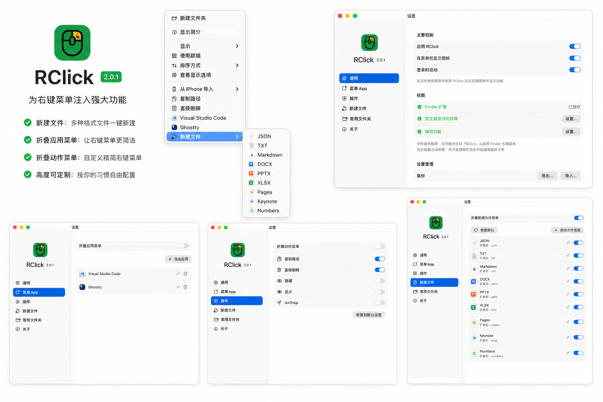

[](https://github.com/wflixu/RClick/releases)

# RClick

[](https://swift.org/)
[](https://developer.apple.com/xcode/swiftui/)
[](https://www.apple.com/macos/macos-sequoia/)
[](https://developer.apple.com/xcode/)
[](LICENSE)
[](https://github.com/wflixu/RClick/releases)
[](https://github.com/wflixu/RClick/releases)
[⭐ Star History](https://star-history.com/#wflixu/RClick&Date)

Enhance your macOS Finder context menu with custom actions. Built with Swift 6.2 and SwiftUI for macOS 15.6+. Full dark mode support with adaptive icons.

## 🚀 Features

- [x] **Open with External App** — Open files or directories with any installed application, with support for custom arguments and environment variables.
- [x] **Copy Path** — Copy the full path of selected files or folders to clipboard.
- [x] **Delete Directly** — Delete files or folders directly, bypassing Trash.
- [x] **Hide / Unhide** — Toggle file visibility in Finder.
- [x] **AirDrop** — Share files instantly via AirDrop.
- [x] **Create New Files** — Generate new files from templates directly in Finder. Supports `.txt`, `.json`, `.md`, `.docx`, `.pptx`, `.xlsx`, as well as Apple iWork formats: `.pages`, `.key`, `.numbers`.
- [x] **Quick Access Folders** — Pin frequently used directories to the right-click menu.
- [x] **Dark Mode** — Full light/dark appearance support with adaptive icons and SF Symbols.

## 🏗 Architecture

RClick uses a dual-process architecture:

| Component | Description |
|-----------|-------------|
| **Main App** (`RClick/`) | SwiftUI menu bar app — manages settings, state, and file operations |
| **FinderSync Extension** (`FinderSyncExt/`) | Injected into Finder — renders custom context menu items |

Communication between the two processes uses `DistributedNotificationCenter`. Settings are persisted via SwiftData with a shared App Group container.

## 📸 Screenshots





## 📦 Installation

### Download

Get the latest release from the [Releases page](https://github.com/wflixu/RClick/releases).

Download the `.dmg`, open it, and drag **RClick** to your Applications folder.

> **Note:** On first launch, you may need to enable the Finder extension in **System Settings → Privacy & Security → Extensions → Added Extensions**.

### Build from Source

```bash
git clone https://github.com/wflixu/RClick.git
cd RClick
open RClick.xcodeproj
```

- Requires **Xcode 16.4+** and **macOS 15.6+**
- Select the **RClick** scheme, then **Product → Build** (⌘B)
- The FinderSync extension will be automatically registered

### Requirements

| Requirement | Details |
|-------------|---------|
| **Folder Access** | Per-folder authorization for file operations (prompted automatically) |
| **Accessibility** | Required for certain automation features |
| **Finder Extension** | Must be enabled in System Settings |

## 🔧 Development

```bash
# Build
xcodebuild -project RClick.xcodeproj -scheme RClick -destination 'platform=macOS'

# Build for Release
xcodebuild -project RClick.xcodeproj -scheme RClick -configuration Release
```

### Key Technologies
- **Swift 6.2** with full concurrency checking
- **SwiftUI** for all UI components
- **AppKit** for system integration only (NSWorkspace, NSPasteboard)
- **SwiftData** for persistence with shared container
- **FinderSync** framework for Finder extension
- **DistributedNotificationCenter** for IPC

### 🌐 Localization

RClick supports three languages with the following priority:

| Language | Code | Notes |
|----------|------|-------|
| **English** | `en` | Default/base language |
| **Simplified Chinese** | `zh-Hans` | Primary localization target |
| **Japanese** | `ja` | Activated when system language is Japanese |

**Principles:**
- Default language is English (also the fallback for unsupported system languages)
- All string keys are in English in the code, localized via `Localizable.xcstrings`
- System language is auto-detected — no manual language picker in the app
- To add a new language, add an entry to `Localizable.xcstrings` and register it in the Xcode project

## 👥 Contributors

Thanks to all the people who have contributed to RClick!

<a href="https://github.com/wflixu/RClick/graphs/contributors">
  
</a>

## 📈 Star History

[](https://star-history.com/#wflixu/RClick&Date)

## Similar Projects

- [SzContext](https://github.com/RoadToDream/SzContext)
- [MenuHelper](https://github.com/Kyle-Ye/MenuHelper)
- [SwiftyMenu](https://github.com/lexrus/SwiftyMenu)
- [OpenInTerminal](https://github.com/Ji4n1ng/OpenInTerminal)

## 🤝 Contributing

We welcome contributions! Here's how you can help:

- **[Report a Bug](https://github.com/wflixu/RClick/issues/new?template=bug_report.md)** — Found something broken? Let us know.
- **[Request a Feature](https://github.com/wflixu/RClick/issues/new?template=feature_request.md)** — Have an idea? We'd love to hear it.
- **[Submit a PR](CONTRIBUTING.md)** — Read our contribution guide to get started.
- **[Security Policy](SECURITY.md)** — How to responsibly report vulnerabilities.

Please read our [Code of Conduct](CODE_OF_CONDUCT.md) before participating.
