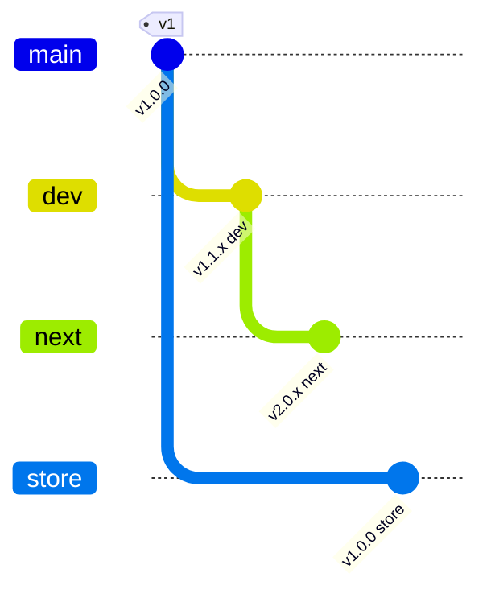
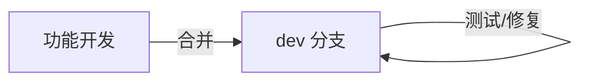
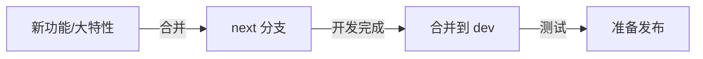
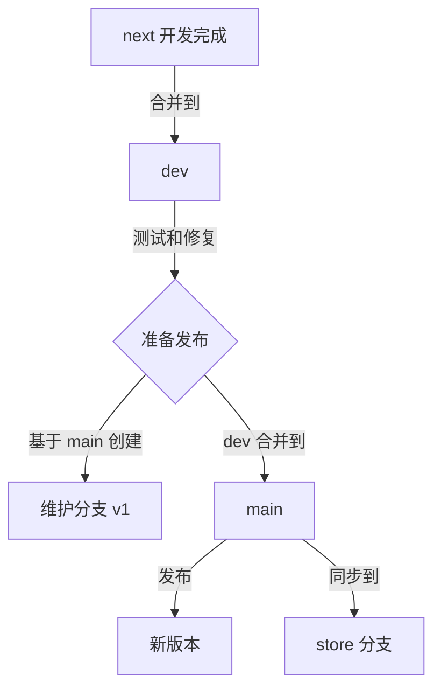
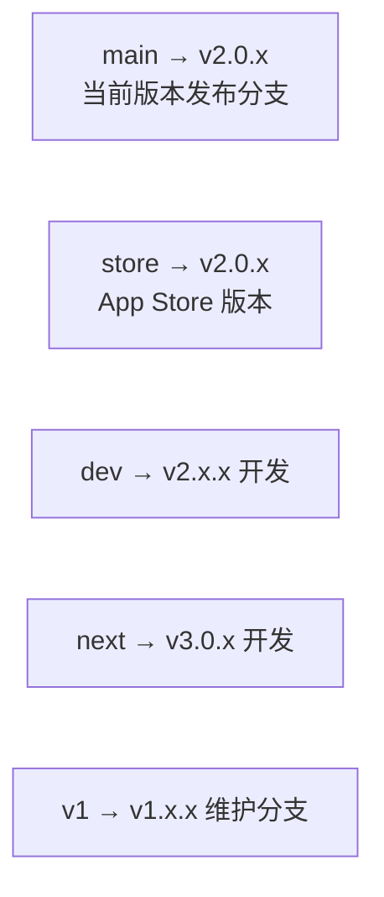
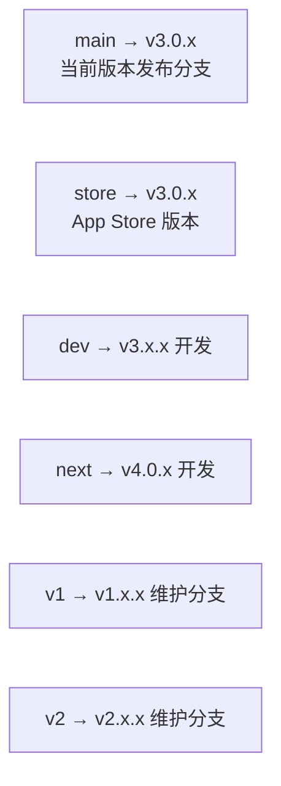

# Git 分支管理策略

## 分支模型

RClick 采用基于版本线的分支管理策略，确保发布版本、开发版本和历史维护版本的清晰分离。

## 分支定义

| 分支 | 定位 | 说明 |
|------|------|------|
| `main` | **当前版本发布分支** | 永远是最新已发布版本的稳定分支 |
| `dev` | **当前版本开发分支** | 正在进行的功能开发和测试 |
| `next` | **下一版本开发分支** | 规划中的下一版本功能开发 |
| `store` | **App Store 版本分支** | 与 main 同步，适配 App Store 审核要求 |
| `v1`, `v2`, ... | **历史版本维护分支** | 被新版本取代后的旧版本维护 |

## 分支关系图



## 工作流程

### 日常开发



### 下一版本开发



### 发布流程



### 发布 v2 示例

```bash
# 1. 准备发布 v2，先创建 v1 维护分支
git checkout main
git checkout -b v1

# 2. 合并 dev 到 main
git checkout main
git merge dev

# 3. 发布 v2 版本
git tag v2.0.0

# 4. 同步到 store 分支（App Store 适配）
git checkout store
git merge main

# 5. 更新 next 分支为 v3 开发
git checkout next
# next 现在用于 v3.0 开发
```

## 发布后的分支状态

### v2 发布后



### v3 发布后



## 分支规则

### main 分支

- **永远是当前已发布版本的稳定分支**
- 只接受从 `dev` 分支的合并
- 每次合并前必须打标签（如 `v2.0.0`）
- 发布新版本前，先将原 `main` 分支创建为维护分支

### dev 分支

- **当前版本的开发分支**
- 接受功能分支的合并
- 用于测试和 bug 修复
- 定期同步 `next` 分支的进展

### next 分支

- **下一版本的开发分支**
- 用于开发新功能、大特性
- 开发完成后合并到 `dev` 进行测试
- 测试通过后，最终合并到 `main`

### store 分支

- **App Store 版本分支**
- 与 `main` 分支保持同步
- 可能包含 App Store 特定的适配（如移除某些功能、调整权限说明等）
- 每次 `main` 发布新版本后同步更新

### 历史维护分支 (v1, v2, ...)

- **只有被新版本取代后才创建**
- 用于旧版本的紧急 bug 修复
- 一般不接受新功能
- 严重 bug 修复后，修复方案应同步到 `dev` 或 `next`

## 当前分支状态

| 分支 | 版本 | 状态 |
|------|------|------|
| `main` | v1 | 当前发布版本 |
| `store` | v1 | App Store 版本，同步 main |
| `dev` | v1 | v1 开发分支 |
| `next` | v2 | v2 开发分支 |

## 注意事项

1. **不要在 main 分支直接提交** - 所有变更必须通过 `dev` 分支合并
2. **发布前创建维护分支** - 发布新版本前，先基于 `main` 创建旧版本的维护分支
3. **store 分支保持同步** - `main` 更新后，及时同步到 `store` 分支
4. **标签规范** - 使用语义化版本标签（如 `v1.0.0`, `v2.1.3`）
